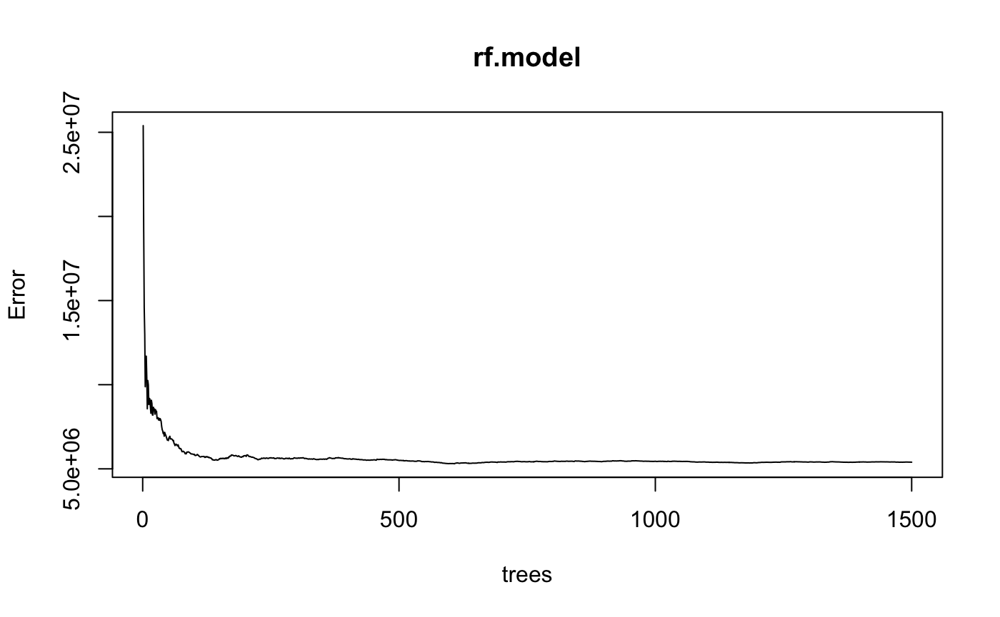

# Car-Price-Prediction
Creating a predictive model based on an automobile company that wants to understand the factors on which the pricing of cars depends.

The objectives of my project are:
1. Which variables are significant in predicting the price of a car?
2. How well those variables describe the price of a car?

<h3>Finding the relation between the symboling variable price:</h3>

<ul>
<li> From the above plots the symboling with 0 and 1 values have a high number of rows which means they are sold the most </li>
<li>The cars with -1 symboling have the highest price</li>
<li>Cars with symboling 3 have the price range similar to -2.</li>
<li>There is a dip in price at symboling 1.</li>
</ul>

<h3>Decision Tree</h3>
I wasn’t able to determine which variables were specifically affecting the price the most by just looking at the table. Hence I included all the variables to visualize the data and classify using a We can visualize the data and classify it according to the conditions:

<h3>Linear Regression Model</h3>
<ul>
<li>When creating the linear model I used price as the response variable and all others as predictors.</li>
<li>I summarized the linear model, and use that information to determine which variables are most important in predicting the response.</li>
</ul>

Through the model I found:
Train Adjusted R^2 = 0.9884
Test Adjusted R^2 = 0.9863

<ul>
<li>The R^2 value is extremely high</li>
<li>The P-Value is small hence this establishes that there exists a relationship</li>
<li>Variables most important in predicting the response:</li>
- CarCompanybmw
- CarCompanypeugeot
- Carbodyhatchback
- Carbodysedan
- Carbodywagon
- Enginelocationrear - Enginetypel
- Enginetyperotor
- Enginesize
- boreratio
</ul>

<h3>Random Forest Model</h3>
<ul>
<li>Training the dataset using the random forest model.</li>
<li> Prediction accuracy on the train set = 4536610</li>
<li>Assess on the test set = 4508604</li>
</ul>

<h3>Variable Importance Plot</h3>

<ul> 
<li>Using cor to compute the correlation of x = 0.9068045</li>
<li>Significant variables after Visual analysis:</li>
- Engine Type
- Fuel type
- Car Body
- Aspiration
- Cylinder Number
- Drivewheel
- Fuel Economy
- Curbweight - Car Length - Car width
- Engine Size - Boreratio
- Horse Power - Wheel base

<h3>urther Exploration</h3>
<ul>
<li>Conduct a bivariate analysis and apply the model to certain variables</li>
<li>Do a cluster model and table on some variables to see how they affect the dataset</li>
<li>Further explore how the ntree and mtry values affect the random forest model accuracy</li>
</ul>
